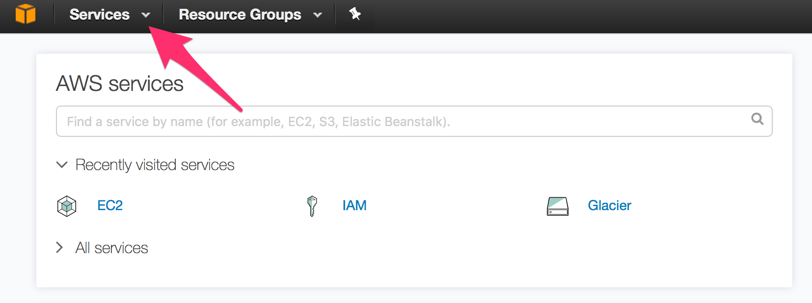
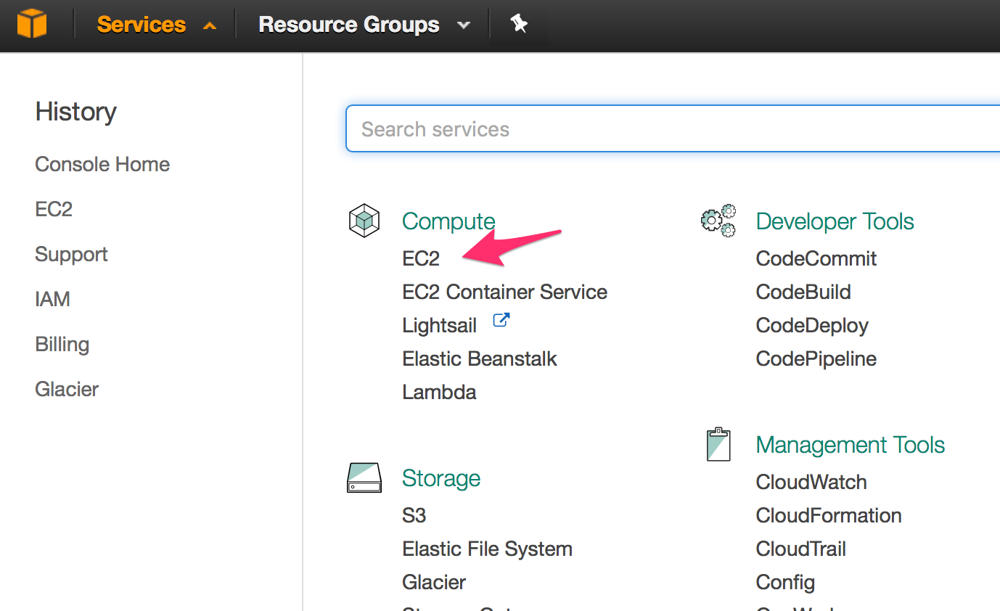
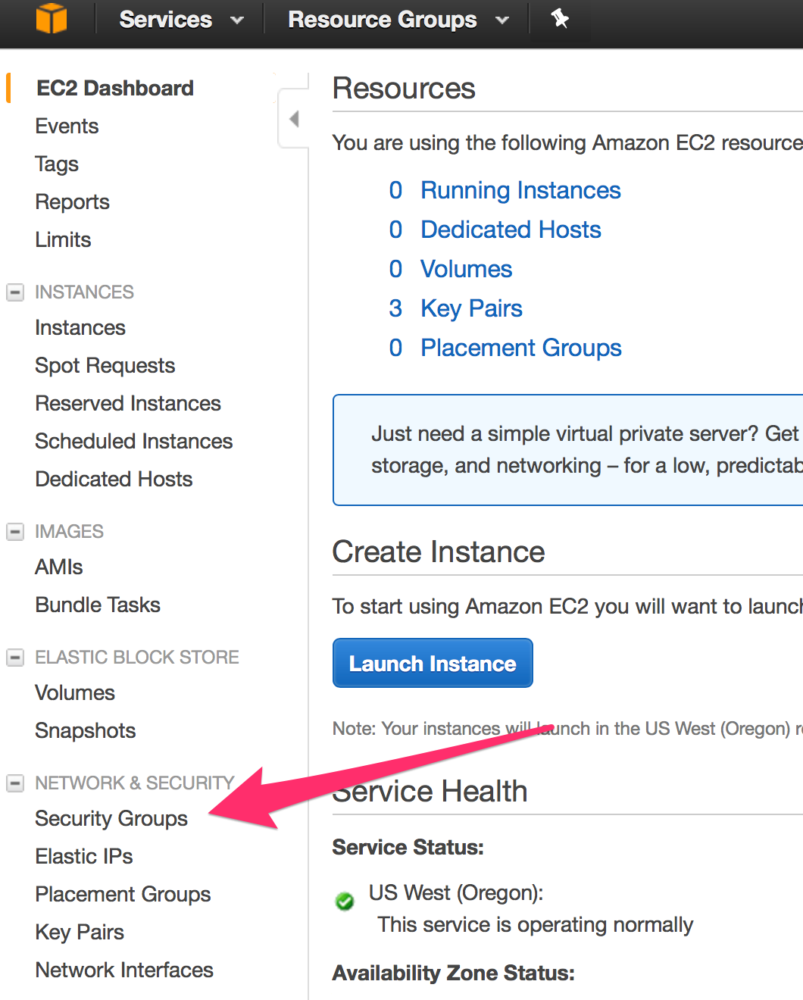
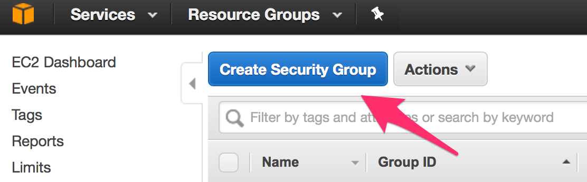
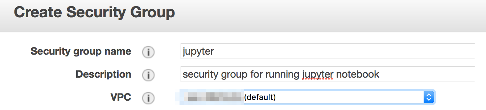
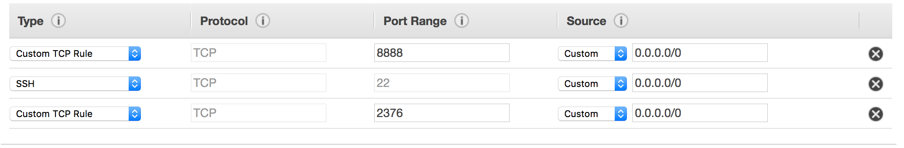

<a name='cli'>
# Create a Security Group on AWS using the Command Line Interface


1. Set your AWS region to the region you wish to use. This tutorial uses 
   `us-west-2`.

   ```
	me@LOCAL: (master)$ aws configure set region us-west-2
   ```

1. Verify that you are configured for the correct region. 

   ```   
   me@LOCAL: (master)$ aws configure list
   	     Name                    Value             Type    Location
   	     ----                    -----             ----    --------
      profile                <not set>             None    None
   access_key     ****************BOTO shared-credentials-file
   secret_key     ****************s32/ shared-credentials-file
	   region                us-west-2      config-file    ~/.aws/config
   ```
   
1. Create the security group

   ```
   aws ec2 create-security-group \
           --group-name jupyter \
           --description 'sc for running jupyter notebook server' 
   ```

1. Update the Inbound Rules for the Security Group `jupyter`. Make sure you enter
   all three of these commands. 

   - for ssh 
   
     ```
     aws ec2 authorize-security-group-ingress \
         --group-name jupyter \
         --protocol tcp \
         --port 22 \
         --cidr 0.0.0.0/0
     ```

   - for docker 
   
     ```
     aws ec2 authorize-security-group-ingress \
         --group-name jupyter \
         --protocol tcp \
         --port 2376 \
         --cidr 0.0.0.0/0
     ```

   - for jupyter 
   
     ```
     aws ec2 authorize-security-group-ingress \
         --group-name jupyter \
         --protocol tcp \
         --port 8888 \
         --cidr 0.0.0.0/0
     ```     
<a name='console'>
# Create a Security Group on AWS using the AWS Console

1. Sign into the [AWS Console](https://aws.amazon.com)
1. Select the region you would like to use. These instructions will use US-West-2.
1. Navigate to EC2.

   

   
   
1. Select Security Groups.

   
   
1. Create a New Security Group.

   
   
1. Describe the new security group with the following values:

   - Security group name: `jupyter`
   - Description: `security group for running jupyter notebook`
   - VPC: **MAKE SURE TO USE DEFAULT VALUE**

   

1. Create the following Security Group Rules

   | Type            | Protocol | Port Range | Source              |
   |-----------------|----------|------------|---------------------|
   | Custom TCP Rule | TCP      | 8888       | Custom // 0.0.0.0/0 |
   | SSH             | TCP      | 22         | Custom // 0.0.0.0/0 |
   | Custom TCP Rule | TCP      | 2376       | Custom // 0.0.0.0/0 |

   
